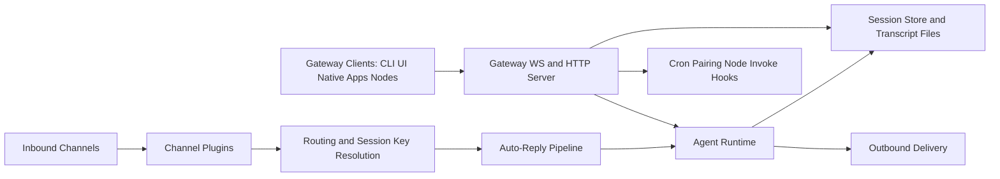

# Full Thread Export: OpenClaw Architecture Deep Dive

This file captures the full architecture information produced in this conversation and publishes it as a public artifact.

## Conversation intent

User request:
- Create an in-depth architecture documentation set for the OpenClaw repository.
- Cover all sections, what they do, how they work, security considerations, and how each piece contributes to gateway/agent/sessions/channels.
- Publish the full information in a public repository.

Outcome:
- Public repo created under `likesjx/openclaw-architecture-deep-dive`.
- Detailed architecture docs added and pushed.
- This file adds the complete conversation-level export context.

---

## High-level architecture map

## Runtime and package topology

- Core package: `openclaw` (Node 22+, ESM).
- Main code: `src/`.
- Plugin ecosystem: `extensions/*`.
- Control UI: `ui/`.
- Native clients/nodes: `apps/{macos,ios,android,shared}`.
- Compatibility wrappers: `packages/{clawdbot,moltbot}`.
- Docs and runbooks: `docs/`.

Largest subsystems by volume:
- `src/agents`
- `src/commands`
- `src/auto-reply`
- `src/gateway`
- `src/infra`
- `src/cli`
- `src/config`

---

## Bootstrap and CLI execution path

Primary startup chain:
- `openclaw.mjs` (bin entry)
- `src/entry.ts`
- `src/cli/run-main.ts`
- `src/cli/program/*`

Important behavior:
- Route-first command handling for faster common commands.
- Lazy subcommand registration to avoid heavy startup costs.
- Global environment normalization and warning filtering.

---

## Gateway subsystem deep dive

Primary files:
- `src/gateway/server.impl.ts`
- `src/gateway/server-http.ts`
- `src/gateway/server-ws-runtime.ts`
- `src/gateway/server/ws-connection.ts`
- `src/gateway/server/ws-connection/message-handler.ts`
- `src/gateway/server-methods.ts`
- `src/gateway/server-methods-list.ts`

Gateway responsibilities:
- Owns channel runtime and control plane.
- Exposes typed WS RPC/events and HTTP APIs.
- Manages cron service, heartbeat service, node registry, device pairing.
- Loads plugin-provided gateway methods/HTTP routes/channels.
- Broadcasts system-wide runtime events.

Protocol model:
- First WS frame must be `connect`.
- Strong schema validation for request/response/event frames.
- Hello snapshot includes health/presence/policy metadata.

---

## AuthN/AuthZ and trust model

Auth implementation:
- `src/gateway/auth.ts`

Supported gateway auth strategies:
- Token
- Password
- Tailscale-assisted identity path (config-dependent)

Handshake hardening:
- Device identity signature verification
- Nonce challenge and timestamp skew checks
- Pairing requirements for unknown/unapproved devices

Authorization:
- Method-level role/scope checks in `src/gateway/server-methods.ts`
- Operator scopes include read/write/admin/approvals/pairing
- Node role is constrained to node-specific methods

Browser/UI controls:
- Origin enforcement in `src/gateway/origin-check.ts`

---

## Agent runtime deep dive

Core path:
- `src/commands/agent.ts`
- `src/agents/pi-embedded-runner/run.ts`
- `src/agents/pi-embedded-subscribe.ts`
- `src/agents/openclaw-tools.ts`
- `src/agents/pi-tools.policy.ts`

Execution lifecycle:
1. Resolve session + workspace + model + auth profile.
2. Queue on per-session lane (+ optional global lane).
3. Execute embedded model/tool loop.
4. Stream lifecycle/assistant/tool events.
5. Handle fallback/provider/model transitions if needed.
6. Persist usage/model/session metadata.
7. Optionally deliver outbound payloads.

Safety controls:
- Tool policy layering (global/agent/profile/group/subagent).
- Optional sandbox policy integration.
- Auth profile cooldown and failover logic.
- Event/payload sanitization boundaries.

---

## Sessions, routing, and state

Key files:
- `src/routing/resolve-route.ts`
- `src/routing/session-key.ts`
- `src/config/sessions/store.ts`
- `src/config/sessions/metadata.ts`
- `src/gateway/session-utils.ts`

Session key model:
- Canonical namespace: `agent:<agentId>:...`.
- DM scope supports shared or isolated contexts:
  - `main`
  - `per-peer`
  - `per-channel-peer`
  - `per-account-channel-peer`

Persistence model:
- Session store map: `~/.openclaw/agents/<agentId>/sessions/sessions.json`
- Turn transcripts: `~/.openclaw/agents/<agentId>/sessions/*.jsonl`

Route resolution inputs:
- Channel/account/peer/guild/team/member roles
- Default agent fallback and binding precedence

Security implications:
- Shared-DM mode can leak cross-user context if multi-user DM ingress is enabled.
- Send policy can deny delivery by channel/chatType/key prefix.

---

## Auto-reply and inbound orchestration

Key file:
- `src/auto-reply/reply/get-reply.ts`

Pipeline includes:
- Context normalization
- Command authorization
- Directive parsing (thinking, verbose, queue, model, etc.)
- Reset/model overrides
- Queue/follow-up handling
- Typing + stream controls
- Agent run dispatch

This subsystem is the main bridge from inbound channel envelopes to agent execution.

---

## Channels and plugin framework

Channel abstraction and docking:
- `src/channels/plugins/types.core.ts`
- `src/channels/dock.ts`
- `src/channels/registry.ts`
- `src/channels/plugins/index.ts`

Plugin platform:
- `src/plugins/discovery.ts`
- `src/plugins/loader.ts`
- `src/plugins/registry.ts`
- `src/plugins/runtime.ts`

Extension examples:
- `extensions/telegram`
- `extensions/whatsapp`
- `extensions/memory-core`
- many other channel/provider/feature plugins

Trust boundary:
- Plugins are loaded and run in-process.
- Registration conflicts and schema validation are enforced.
- Plugin code is still trusted code at runtime.

---

## HTTP APIs and external surfaces

Endpoints:
- OpenAI-compatible: `src/gateway/openai-http.ts`
- OpenResponses-compatible: `src/gateway/openresponses-http.ts`
- Tool invoke: `src/gateway/tools-invoke-http.ts`
- Hook routing + control UI: `src/gateway/server-http.ts`

Common protections:
- Gateway auth checks on HTTP surfaces
- Body size constraints
- Validation and policy checks for URL/file/media ingest paths
- Hook auth throttling and token verification

---

## Cron and automation internals

Core files:
- `src/cron/service.ts`
- `src/cron/service/ops.ts`
- `src/cron/isolated-agent/run.ts`

Execution styles:
- Main-session wake/system-event jobs
- Isolated agent-turn jobs (`cron:<jobId>` contexts)

State and durability:
- Persistent scheduler store
- Run logs and status surfaces exposed via gateway methods

---

## Node/device subsystem

Key files:
- `src/gateway/node-registry.ts`
- `src/gateway/server-methods/nodes.ts`
- `src/gateway/server-node-events.ts`

Behavior:
- Node clients connect with declared caps/commands.
- Gateway dispatches node invoke requests and receives results.
- Node events can be translated into session/system events.

Security:
- Pairing/token checks required
- Command allowlist filtering at connect/runtime

---

## Memory architecture

Core files:
- `src/memory/manager.ts`
- `src/memory/search-manager.ts`
- `src/memory/sqlite-vec.ts`
- Plugin exposure via `extensions/memory-core/index.ts`

Model:
- Markdown files are source of truth.
- Optional vector retrieval/index for semantic memory lookup.
- Memory tools exposed through plugin slot mechanism.

---

## Config and state management

Config path and validation:
- `src/config/io.ts`
- `src/config/validation.ts`
- `src/config/legacy-migrate.ts`

Features:
- JSON5 parsing
- includes and env var substitution
- defaults and runtime overrides
- legacy key migration and diagnostics

Security-relevant notes:
- Include/env resolution can expand attack surface if misused.
- Security audit CLI checks permission and risky config posture.

---

## Security-specific docs surfaced during analysis

- `docs/gateway/security/index.md`
- `docs/gateway/authentication.md`
- `docs/cli/security.md`
- `docs/security/README.md`

Key posture themes:
- Lock down DM/group ingress policy first.
- Keep gateway auth strict when exposed off-loopback.
- Treat plugin and tool access as high-trust operations.
- Use send/tool/sandbox policies to constrain blast radius.

---

## Native apps and UI surfaces

- Control UI: `ui/` (Lit + Vite)
- macOS: `apps/macos`
- iOS: `apps/ios`
- Android: `apps/android`
- Shared protocol/client kit: `apps/shared/OpenClawKit`

These clients connect through the same gateway protocol model and inherit gateway security/session semantics.

---

## Public release artifact summary

This repository now includes:

- `README.md`
- `docs/openclaw-architecture-deep-dive.md`
- `docs/thread-export-full.md` (this file)

with the architecture content and conversation-level export intent.

